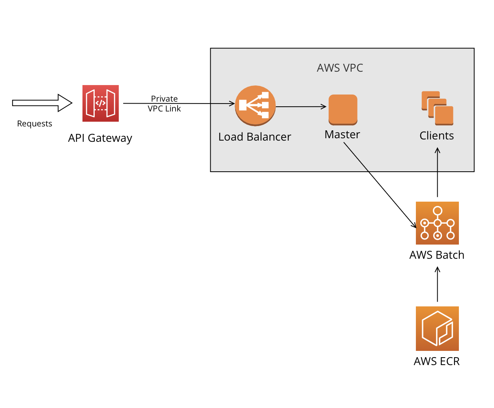

# CaesarCipher
## About The Project
This is a simple demo to decrypt Caesar Cipher Encrypted csv file. The are two Docker containers in this process. The master node is talking to 2 client nodes using sockets. 
1. The MASTER node should do the following:
- [x] Read the text files from the file system
- [x] Output the calculation result to the screen (calculated by the client node)
2. The CLIENT nodes should do the following:
- [x] Receive the contents of the file in a string format from the master node
- [x] Decode the text into a CSV file using the Caesar Cipher encryption method.
- [x] Calculate the maximum value of each column in the file Return the result in a JSON form.

## How to run the project
Swagger UI (Debug Mode): `localhost:<WEB_API_Port>/swagger/index.html`

**With Docker:**
This will create a container with the application
Make sure that you have Docker installed on your machine & running.
1. Clone the repository
2. Update MasterAPI  DockerFile, WEB_API_Port
3. Update launchSettings applicationUrl to WEB_API_Port
4. In each respective directory, build the container images using the commands:
- (From ./MasterNodeAPI or ./ClientNode)`docker build . -t <image_name>`
5. After a successful build, run the two containers using the commands:
- MASTER Node: `docker run --name <server_container_name> --rm -d -p <webApiPort>:<WEBAPI_API_Port> <master_img_name>`
- CLIENT Node: `docker run --name <client_container_name> --rm -it -P <client_img_name>` Supply the corresponding IP Address and Port number from the Master Node.

### Technologies & Features
- [x] ASP.NET Core 6 WebApi
- [x] XUnit with Moq Testing Framework
- [x] REST Standards
- [x] Swagger UI
- [x] Docker 

### Endpoints
**Decrypt File**
- `/decryptFile?fileName=<txtFileName>`
- Supply the filename of the textfile (e.g. `encrypted_1.txt` or `encrypted_2.txt`)

## AWS Implementation 

### AWS Services
- [x] **API Gateway**
-The API Gateway receives requests, they actively manage incoming traffic and maintain service availability through rate limiting, preventing system overloads and ensuring consistent performance. This also allows the isolation between the requests to the public API endpoints and the private network for socket communication between the Master and Client nodes.
- [x] **Elastic Load Balancer**
-The load balancer distributes incoming application traffic across multiple targets, such as EC2 instances, in multiple Availability Zones. Load balancers are pivotal for scalability and can greatly improve the performance and efficiency of the application. The scaling of the Master node will be automated using this service.
- [x] **Elastic Compute Cloud(Amazon EC2)**
-Amazon Elastic Compute Cloud (Amazon EC2) provides scalable computing capacity in the AWS Cloud. The containerized Master and Clients will be deployed in the cloud using this service.
- [x] **AWS Batch**
-AWS Batch allows applications to efficiently run hundreds of thousands of batch computing jobs while optimizing compute resources. New Client instances will be created based on the demand for decryption. For every request to the Master Node, a new tcp connection is established thus new client instances will be needed. The master node will queue a batch job by using the BatchClient API from the AWS SDK for .NET. Batch Jobs are divided into 3 tasks:
1. Computation for the Offset
2. Decoding the text file to CSV
3. Finding the maximum values per column and saving to JSON
- [x] **Elastic Container Registry (ECR)**
-ECR stores, manages, deploys, and shares Docker containers that will be used by AWS Batch. Services such as AWS Auto Scaling can also be applied for greater scalability.
- [x] **Virtual Private Cloud (VPC)**
-EC2 instances are deployed in a logically isolated defined virtual network. This virtual network closely resembles a traditional network and provides better network security for the Master and Client instances.  
- [x] **Identity and Access Management (IAM)**
-AWS Batch compute environments and container instances require AWS account credentials to make calls to other AWS APIs programmatically. An IAM role provides these credentials to the compute environments and container instances, then associate that role with the compute environments.

